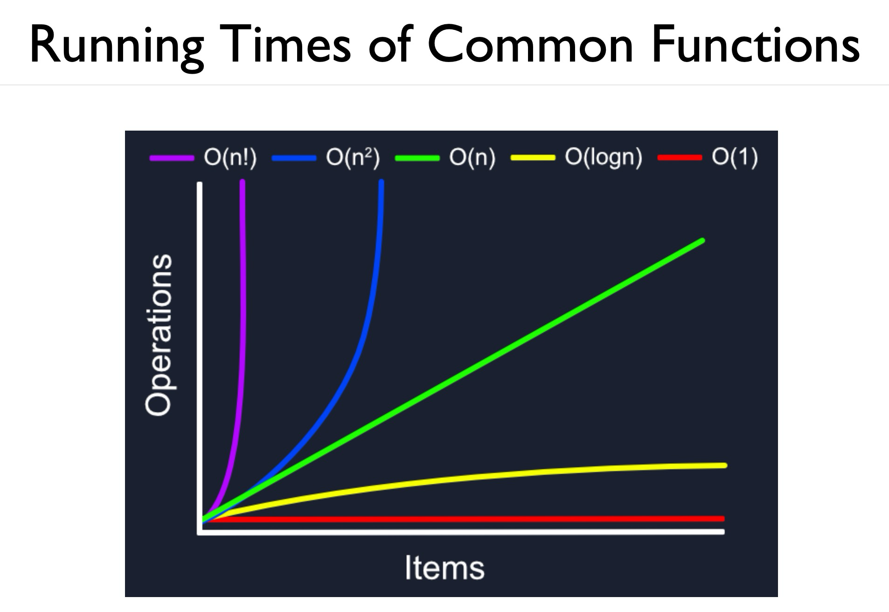
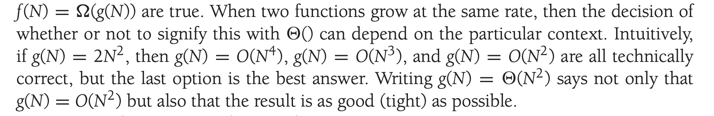

<h1 style="text-align:center;">Lecture 1: Analysis Tools</h1>

---

## Abstract Data Types v/s Data Structures

A good program:

- Should work as specified and should be bug-free.
- Is easy to understand and modify.
- Should be modular and efficient.

<br>

### Abstract Data Types (ADTs)

An **ADT** is a mathematical model of a data structure which encodes the **type** of data stored and the **operations** supported on them.

#### Examples:
- **List**: an ordered collection of items `(item_1, item_2, ..` supporting `add(), size(), ...`

- **Stack**: Last-In-First-Out collection of items supporting `push(), pop()`

Every ADT can be implemented thorugh one or more data sturucture, typically using OOP principles to overload functions to support operations.

---

<h1 style="text-align: center;">Experimental Analysis</h1>

### Efficiency

It is tied with the usage of system resources (CPU, memory, disk, energy, e.t.c.).

Some resources may matter more than other in certain contexts; for instance, memory is more precious in lower-end devices, especially smartphones.

<br>

This course will focus on:
- **Running time**: the length of algorithm execution. This depends on several factors, including system recources, input size, and algorithm steps.
- **Space efficiency**: the amount of memory used by the algorithm.

<br>

#### Types of Running Time:

1. **Best Case**: the running time on the easiest input. 
2. **Average Case**: the average running time over all possible inputs.
3. **Worst Case**: the running time on the worst / hardest input (worst-case scenario).

<br>

### Carrying out Experimental Analysis

Suppose we want to analyze the average running time of two algorithms:

- Implement the two algorithms.
- Use a timing library (as above) to measure time.
> On Linux/Mac, the `time` utility is used to compute algorithm running times.
- Ensure that the impact of external factors is minimal / zero.
- Run the algorithms multiple times for each input class / size to filter out random errors.
- Find the average and standard deviations of the running times.

> **Note**: It may not be feasible to evaluate algorithms over very large datasets due to practical constraints.
> In some cases, system and configuration overheads are inevitable.

---

<h1 style="text-align: center;">Asymptotic Analysis and Big-O</h1>

Asymptotic Analysis can help us quantify the growing rate of running time as a function of the input size $n$.

This way, rather than trying to account for overheads in runtime for **each** input size, algorithms can be analyzed based on **varying** input sizes.

<br>

## RAM (Random Access Model) of Computation:

A hypotethical computer which forms the basis of assumptions made for asymptotic analysis.

Following are some assumptions made for this model:

1. Each primitive operation in this model takes one step.
2. Loop and function calls are non-primitive, depending on input size and function implementations.
3. An infinite pool of memory is present, with memory access being one step as well.

Although these assumptions are reductive and are violated in the real world, this model proves to be an excellent model in practice.

<br>

## Big-O Notation

>**$f(n)$** is **$O(g(n))$** if there exists positive constants **$c, n_0$** such that: $$\forall n \geq n_0: f(n) \leq c \cdot g(n)$$

In simpler terms, we can say **$f(n)$ is $O(g(n))$ if $f(n)$ grows no faster then $c \cdot g(n)$** for all $n \geq n_0$.

For $O(n), \:\boxed{g(n) = n}$

<br>

Big-O / **Order-of** is a way to express the upper bound / worst-case scenario of an algorithm's time complexity.

For instance:

$$T_1(n) = 6n + 10$$

- Constants do not matter as $n \rightarrow \infty$
- Multiplicative factors also do not matter much.

Hence, as $n \rightarrow \infty$, $T_1$ tends to $\boxed{n}$
<br>

### Example 1: Is $2n + 10 \in O(n)$?

- Approach 1. Solve the inequality for c to find a $(c, n_0)$ pair which satisfies it.
- Approach 2. Decompose the problem and apply the rules term-by-term.

<br>

**Using Approach 1:**

$$ 2n - 10 \leq c * n \:\Rightarrow\: n \leq \frac{10}{c - 2} \:\Rightarrow\: \boxed{n_0 = \frac{10}{c - 2}}$$

$n_0$ represents the lower bound of n, hence a valid pair would be $(c = 3, n_0 = 10)$ or $(c = 4, n_0 = 5)$.

$$\boxed{\text{Hence, } 2n + 10 \in O(n)}$$


<br>

**Using Approach 2:**

We know that $2n \leq 2n$, and $10 \leq 10n$, hence, $2n + 10 \leq 2n + 10n \:\Rightarrow\: 2n + 10 \leq 12n$, where $c = 12$.

Hence, $2n + 10$ is bounded above by $12n$ for $n \geq 1$.

<br>

### Example 2: Is $n^2 \in O(n)$?

<br>

**Using Approach 1:**

$$n^2 \leq c \cdot n \:\Rightarrow\: n \leq c$$

The constant $c$ is always greater than or equal to $n$; as $n$ grows, it becomes arbitrarily large, and hence this inequality does not hold $\forall n \geq n_0$.

Intuitively, $n^2$ grows much faster than $n$, so $n^2$ cannot be bounded by a constant multiple of $n$.

<br>

---



---


### Code Example: Tightest O(n):

```c
for (int i = 0; i < n; i++)
    count += 1;

for (int i = 0; i < n**2; i++)
    count += 1;
```

The tightest $O(n)$ is **$O(n^2 + n)$**, which defaults to **$O(n^2)$** since lower order terms are ignored.

<br>

>Note: For the best results, complexities must be as "tight" as possilble. 

