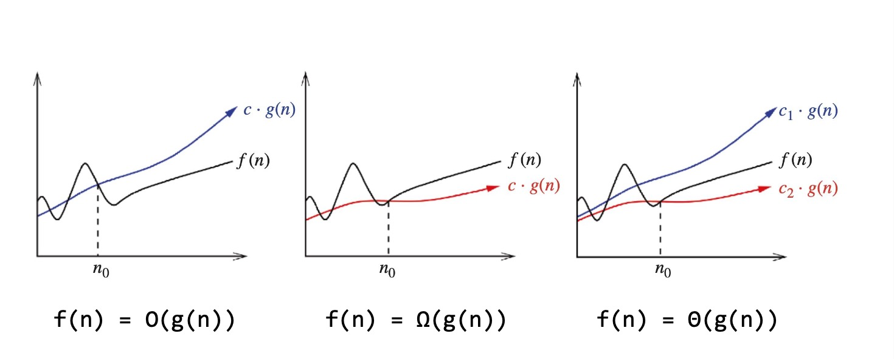
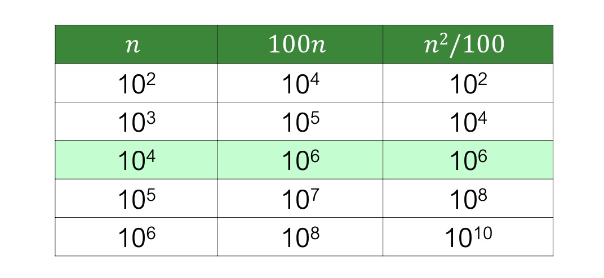

<h1 style="text-align=center;">Asymptotic Analysis</h1>

---

## Some Big-O Practice

### Problem 1: Find the tightest $O(n)$:

```c
for (int i = 0; i < n; i++)
{
    for (int j = 0; j < logn^2; i++)
        count += 1
}
```

The code block runs in $O(n \cdot log(n^2))$ time, which is the same as $O(2n \cdot log(n))$, which is effectively **$\boxed{O(n \cdot log(n))}$**.

<br>

### Problem 2: Is $e^{3n} \in O(e^n)?$

$$e^{3n} \leq c \cdot e^n \Rightarrow c \geq e^{2n}$$ No it is not.

In other words, $e^{3n}$ grows much much faster than $e^n$, hence it will outstrip $e^{2n}$.

<br>


### Problem 3: Find the number of primitive operations:

```c
    for (i = 0; i < n; i++)
    {
        if (arr[i] == x)
            return i;
    }
    return -1;
```

Worst case scenario:
- `i = 0` is one operation.
- `i < n` happens `n+1` times.
- `i++` happens `2n` times, since its both an increment and an assignment.
- `if (arr[i] == x)` happens `2n` times, since its both a memory access and a comparison.
- This code will return `-1` if the item is not found, which is an extra operation.

Hence the total number of primitve operations will be `5n + 3`.

<br>

In the best case scenario there will be `5` primitive operations.

---

## Cousins of Big-O:

### Big-Omega $\boxed{\Omega(g(n))}$ Complexity:

>**$f(n)$** is **$\Omega(g(n))$** if there exists positive constants **$c, n_0$** such that: $$\forall n \geq n_0: f(n) \geq c \cdot g(n)$$

Its effectively the opposite of $O(g(n))$, representing a lower bound on  $f(n)$.

<br>

#### Example: Is $5n^2 \in \Omega(n^2)$?

$$5n^2 \geq c \cdot n^2 \Rightarrow \boxed{c \leq 5}$$
Yes it is.

Intutively, since both are powers-of-two, the above statement must be true.

<br>

#### Example: Is $7n^2 + 100n + 6 \in \Omega(n)?$

Intuitively, every quadratic is eventually an upper bound of a linear function, therefore a linear function is eventually a lower bound of a quadratic function.

Analytically, we have $7n^2 \geq 7 \cdot n$ and $100n \geq 100 \cdot n$. Then: $7n + 100n = 107n$.

Let $c = 107$ (can be any value), then:

$$7n^2 + 100n + 6 \geq 107 \cdot n \Rightarrow \text{a pair: } (c = 107, n_0 = 1)$$

<br>

### Big-Theta $\boxed{\Theta(g(n))}$ Complexity:

>**$f(n)$** is **$\Omega(g(n))$** if there exists positive constants **$c, n_0$** such that: 
> $$c_1 \cdot g(n) \leq f(n) \leq c_2 \cdot g(n)$$

In other words, **$f(n) \in \Theta(g(n))$ if it is both $O(g(n))$ and $\Omega(g(n))$.**

<br>

#### Example: Is $10n^2 \in \Theta(n^2)?$

Since it is both in Big O and Big-Omega, it is also in Big-Theta.

---
## Complexity Comparisons



---

## Some caveats in Big-O complexity interpretations:

-  Same Big-O complexity algorithms are hard to differentiate between.

If Algorithm A is runs in $n^2$ and Algorithm B runs in $10n^2 + n$, both are technically tightened to $O(n^2)$, but A runs faster that B in practice.

- Some algorithms might run faster in smaller dataset sizes than other, even if their Big-O times differ.

If A  runs in $100n$ and B runs in $\frac{n^2}{100}$, smaller input sizes will cause A to dominate in complexity, but is outstripped by B for larger datasets.



---

