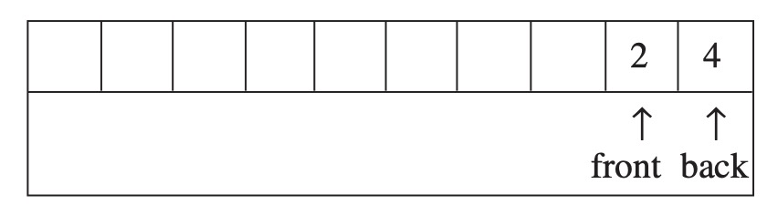

<h1 style="text-align:center">Linear Data Structures</h1>

---

## Queue ADT

A structure where elements are enqueued or dequeued. Unlike a stack, a queue always dequeues the first element which was enqueued in order, following the "First In, First Our Principle"

Queues have a lot of applications, acting as buffers for data waiting to be processed by printers, routers, servers on a network, users to be served by a call center, e.t.c.

A queue can be implemented using both **arrays** and **linked lists**.

```c++
template <typename T>
class Queue
{
// usually inherits underlying structure from a parent ADT
public:
    virtual void enqueue(const T& ele) = 0;
    virtual T dequeue() = 0;
    virtual T front() = 0; // return the first most element without removing it
    virtual bool isEmpty() const  = 0;
    virtual bool isFull() const = 0;
    virtual size_t size() const = 0;
    virtual ~Queue() {}
};
```


Which of these queueing operations (if not all) can be optimized to $O(n)$?

$\\[25pt]$

### Implementation #1: Using a linked list:

$\\[15pt]$
#### (a) Singly Linked List
For a singly linked list, the front of the queue should be at the least recently added node (the first node in the sequence) / a new node enqueues at the last added node, i.e. the `rear` is at the `tail`. This would make `enqueue` and `dequeue` run in $O(1)$ time. 

If instead, the `rear` was at the `head` of the list, `enqueue` would take $O(1)$ time while `dequeue` would take $O(n)$ time, since you would need the referecne of the second-to-last node to point it forwards to `NULL`.

$\\[15pt]$
#### (b) Doubly Linked List

For a doubly-linked list however, since we would have references to both the previous and next nodes, both `enqueue` and `dequeue` operations can be performed in $O(1)$ time regardless of whether the `rear` is at the `head` or `tail` of the list.


$\\[25pt]$

### Implementation #2: Using arrays:

There are two ways to go about this:

$\\[15pt]$

#### (a) Fixing `rear` to index 0:

For every subsequent `enqueue` after the first one, all elements must be shifted to the right to make room for the newly enqueued element at index 0, making `enqueue` run in $O(n)$. Since `dequeue` removes from index = `queue_size - 1`, this runs in $O(1)$

$\\[15pt]$

#### (a) Fixing `rear` to index `queue_size - 1`:

Like before, `enqueue` would take $O(1)$ time but `dequeue` would require shifting of elements towards `front`, making it run in $O(n)$ time.

$\\[25pt]$

Instead of fixing `rear` to some index, what if we made it free to move? We could solve the problem of any one operation being $O(n)$ by making `rear` and `front` slide freely around the array.

The problem arises when one of the pointers hits the boundaries of the array. There is no way to surpass the confines of the allocated memory without allocating new space, which makes things inefficient.



#### Solution: Circular Queue:
In a circular queue, the `rear` and `front` pointers wrap around to the beginning of the array when they reach the end. This allows us to utilize the array space efficiently without needing to shift elements.

**Example**: if a queue had a size of 6, that means the pointers are restrixted to an index space from 0-5. The modulo operation can be used to wrap around the pointer whenever one of them reaches 6.

1. **Enqueue Operation**:
    - Add the new element at the position pointed to by `rear`.
    - Increment the `rear` pointer to the next position. If `rear` reaches the end of the array, it wraps around to the beginning (i.e., `rear = (rear + 1) % array_size`).

2. **Dequeue Operation**:
    - Remove the element at the position pointed to by `front`.
    - Increment the `front` pointer to the next position. If `front` reaches the end of the array, it wraps around to the beginning (i.e., `front = (front + 1) % array_size`).

3. **Checking Full and Empty Conditions**:
    - The queue is full if the next position of `rear` is `front` (i.e., `(rear + 1) % array_size == front`).
    - The queue is empty if `rear` is equal to `front`.

This way, both `enqueue` and `dequeue` operations can be performed in $O(1)$ time, making the circular queue an efficient implementation.
