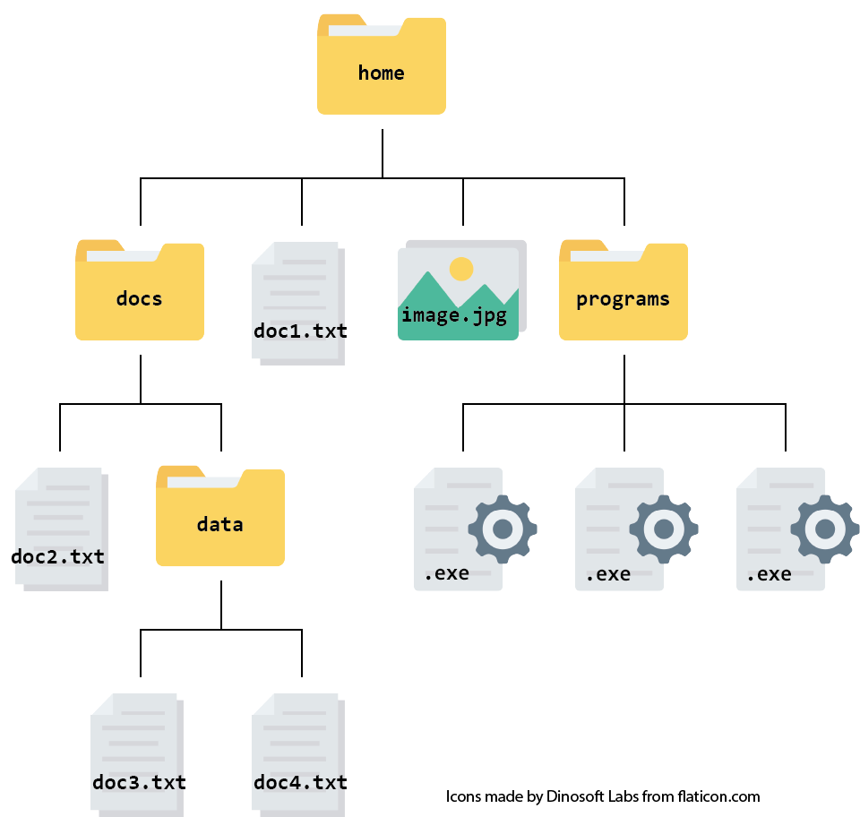

<h1 style="text-align: center;">Trees</h1>

---

## m-ary Tree:

An m-ary tree is a tree where any node has a maximum of `m` direct children, i.e. an internal node N is the parent of a maximum of `m` children.

A tree with `m = 2` is a **binary tree**.

---


## Representing Trees

We can represent a tree with its tree nodes using either **arrays** or **linked lists**.

### (a) Using arrays:
In an array, nodes will be stored sequentially in memory, which improves cache efficiency, but requires shifting elements in insertion and deletion operations, which is inefficient.

```cpp
template <typename T>
class TreeNode
{
public:
    // default constructor
    TreeNode();

private:
    int data;
    TreeNode* parent;
    TreeNode** children;  // an array of children for each node
    // std::vector<TreeNode*> children -> for dynamic sizing
};
```
$\\[25pt]$
### (b) Using linked-lists:

A linked list seems like a natural choice to represent a tree; upon each node addition, memory is dynamically allocated which saves space, and node operations can be executed efficiently.

```cpp
template <typename T>
class TreeNode
{
public:
    // default constructor
    TreeNode();

private:
    int data;
    TreeNode* parent;
    TreeNode* firstChild;  // linked list of children
    TreeNode* nextSibling;  // pointer to a sibling
};

class Tree
{
public:
    Tree();
    int getSize(); // O(1)
    bool isEmpty(); // O(1)
    bool isRoot(TreeNode* node);  // O(1)
    bool isExternal(TreeNode* node);  // O(1)
    TreeNode* root(); // O(1)
    TreeNode* parent();// O(1)
    TreeNode* children(TreeNode* node); // O(number of children)
    void insert(string data);
    TreeNode* search(int data);
private:
    int size;
    TreeNode* root;
};
```
---

## Other Tree Operations

$\\[15pt]$

### `Depth()` and `Height()`:

Depth is the number of edges from the current node to the root, while the height is the maximum number of edges from the current node to a leaf.

#### Best Case: Balanced Tree:

A balanced tree is one where the height of a tree is minimised, with equal distribution of nodes across levels. For a balanced m-ary tree, both `depth()` and `height()` can run in $O(log_m(n))$.

#### Worst Case: Skewed Tree:
When the tree is highly skewed (i.e., each node has only one child, like a linked list), both depth and height operations degrade to $O(n)$, where n is the number of nodes.

>For average trees, both operations are $O(log(n))$ on average.

$\\[25pt]$

---

## Tree Traversals

A tree can be traversed in multiple ways to access data, depending on the application.

Traversals can be used to:
1. Evalute expressions, using infix, prefix and postfix notations and mapping them to certain types of traversals.
2. Print nodes layer by layer in applications like printing organization hierarchies.
3. Copy and serialize tree structures for storage or transmission.
4. Detect cycles or validate tree properties during tree maintenance.

$\\[15pt]$

### Preorder Traversal:

In preorder traversals, the current / root node is processed before its children are. For smaller trees, traversals are usually implemented using recursion:

```cpp
void preOrder(TreeNode* root)
{
    // base case
    if (root == NULL)
        return;

    // process the current root

    preOrder(x->left);
    preOrder(x->right); // assuming a binary tree
}
```

#### Example: A filesystem:

$\\[20pt]$



$\\[15pt]$
If the preorder traversal were to output all nodes' filenames (left to right), it would be:

```bash
home
docs
doc2.txt
data
doc3.txt
doc4.txt
doc1.txt
image.jpg
programs
.exe
.exe
.exe
```

$\\[20pt]$
### Postorder Traversal:

In postorder traversal, a node is processed after all its children. This can be especially useful for operations where you need to work from the leaves upward.

```cpp
void postOrder(TreeNode* root)
{
    // base case
    if (root == NULL)
        return;

    // visit the children first
    preOrder(x->left);
    preOrder(x->right); // assuming a binary tree

    // process the current root
}
```


For example, considering our filesystem image, a postorder traversal might output the filenames in the following order:

```bash
doc2.txt
doc3.txt
doc4.txt
data
docs
doc1.txt
image.jpg
.exe
.exe
.exe
programs
home
```

$\\[20pt]$
### Inorder Traversal (Binary Trees Only):

Inorder traversal is typically defined for binary trees. It visits the left subtree first, then processes the current node, and finally visits the right subtree. This ordering is particularly useful in binary search trees to retrieve sorted data.


```cpp
void inOrder(TreeNode* root)
{
    if (root == NULL)
        return;

    inOrder(root->left);
    
    // Process the current node
    // e.g., std::cout << root->data << std::endl;
    
    inOrder(root->right);
}
```
$\\[10pt]$
In the above example, an inorder traversal might print:

```bash
doc2.txt
docs
data
doc3.txt
doc4.txt
doc1.txt
home
programs
.exe
.exe
image.jpg
.exe
```

$\\[20pt]$

### Level-Order Traversals:

This type of traversal vists nodes *layer-by-layer*, using a queue to store children nodes, initially containing the root.

Unline other traversals, it is non-recursive, since it maintains nodes in a queue and processes them iteratively:

```cpp
void levelOrder(TreeNode* root)
{
    if (root == NULL)
        return;
    
    queue<TreeNode*> q;
    q.push(root);
    
    while (!q.empty())
    {
        TreeNode* current = q.front();
        q.pop();
        
        // Process current node
        // e.g., std::cout << current->data << std::endl;
        
        // Add children to queue
        if (current->left)
            q.push(current->left);
        if (current->right)
            q.push(current->right);
    }
}
```